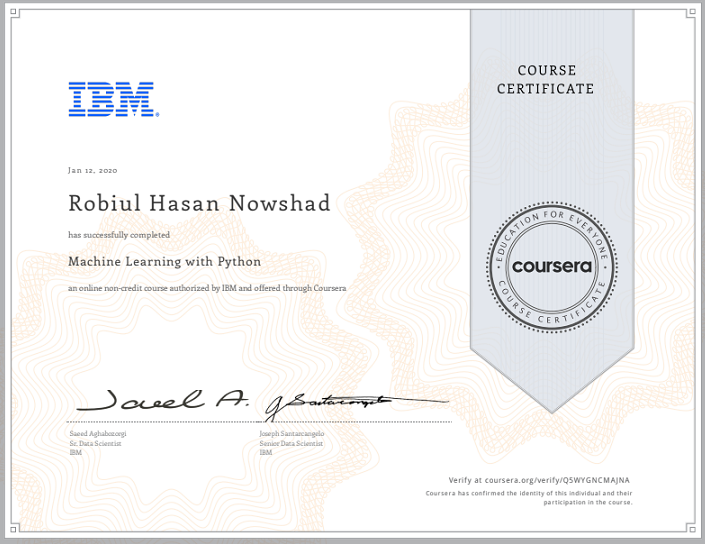

## Machine Learning with Python
### Offered By IBM on Coursera
I learnt about the purpose of Machine Learning and where it applies to the real world. I got a general overview of Machine Learning topics such as supervised vs unsupervised learning,  model evaluation, and Machine Learning algorithms. 

### Topic: 
Regression, Classification, Clustering, Sci-kit learn and SciPy
### Projects: 
Cancer detection, predicting economic trends, predicting customer churn, recommendation engines, and many more.

## Final Capston Project:
[See Capstone Project](https://github.com/nowshad7/Coursera-ML-capstone-project)

[Credential]()

## Certificate:
[Credential](https://www.coursera.org/account/accomplishments/certificate/Q5WYGNCMAJNA)

